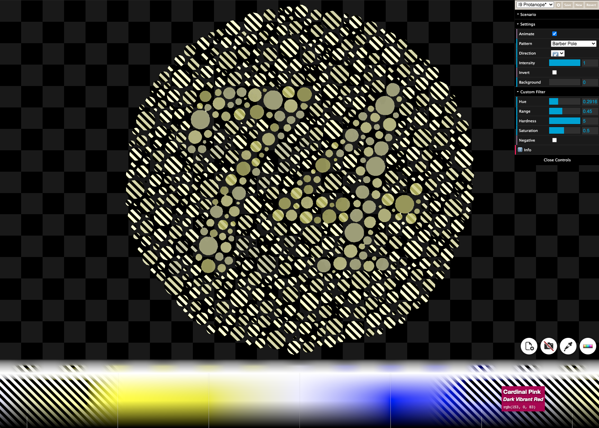

# UncolorBlind

**UncolorBlind** is a web app that shows color in ways the color-blind can see.

It is based on a [single GLSL shader](./src/shader.glsl), which implements the color dithering with a few variants and parameters.

### Online Version

[Try the online demo](https://unblind.tech/).

### Installation

- Set up a `node.js` environment with `yarn`.
- Clone this repo
- Run `yarn install`
- Run `yarn run dev`
- Run a local webserver such as `updog` in the `public`.

### License / Credit

Code is [MIT licensed](LICENSE.md).

By [Steven Wittens](https://acko.net/).

